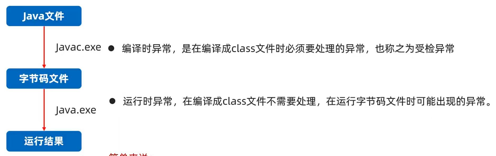

# Exception & Error extends Throwable

## Error
系统级别问题、JVM退出等，代码无法控制

## Exception
* 异常，在编译或运行时可能出现的问题
* 如果不提前捕获处理异常，程序就会退出JVM终止运行

```java
import java.lang.Exception;

public class Exception extends Throwable{
    // ...
}
```

- `RuntimeException`及其子类
  - 运行时报错，编译阶段难以发现
  - 诸如`NullPointerException`、`ArrayIndexOutOfBoundsException`等等
- 其他所有异常
  - 编译期必须要处理



### RuntimeException
- **默认**在出现异常的代码处自动创建一个异常对象`<? extends RuntimeException>`
- 异常从出现点抛出给调用者，调用者最终抛出给JVM
  - 按照栈的顺序一步步打印
- JVM收到异常后，现在控制台输出异常栈信息
- JVM直接杀死程序，异常点之后的代码不会再运行
