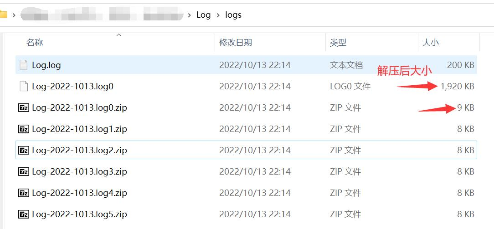
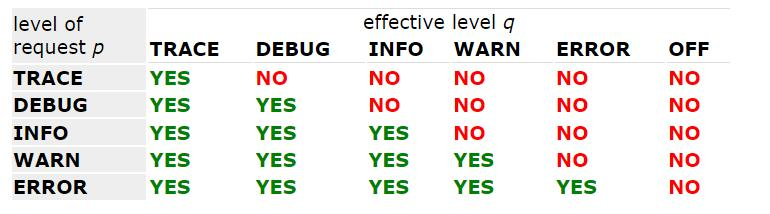

# Log 日志

|      |  print   |     日志     |
|:-----|:--------:|:----------:|
| 输出位置 |  只能在控制台  | 控制台、文件、数据库 |
| 取消输出 | 需要直接修改源码 |  不需要修改代码   |
| 多线程  |   性能较差   |    性能较好    |

### Java日志体系结构
- 日志规范接口 `Commons Logging`
  - `JCL`
- 第三方框架 
  - `Simple Logging Facade for Java` or `slf4j`
  - `Logback`
- 等

### `Logback` 性能版 `log4j`
> https://www.slf4j.org/index.html
> https://logback.qos.ch/index.html

### `logback.xml` logback配置文件
> https://logback.qos.ch/manual/configuration.html

* 测试环境下使用 `logback-test.xml`
* 产品环境下使用 `logback.xml`

### 1. 简单配置`logback.xml`进行控制台输出
> https://logback.qos.ch/manual/configuration.html#dumpingStatusData
### 2. 添加状态监听
> https://logback.qos.ch/manual/configuration.html#dumpingStatusData
### 3. 配置log文件输出 -> Configuring Appenders
> https://logback.qos.ch/manual/configuration.html#configuringAppenders
### 4. log文件压缩
> https://logback.qos.ch/manual/appenders.html#RollingFileAppender
```xml
<!-- RollingFileAppender 压缩文件 -->
<appender name="FILE" class="RollingFileAppender">
    <!-- 日志输出文件路径 -->
    <file>./Log/logs/Log.log</file>
    <encoder class="PatternLayoutEncoder">
        <pattern>%date %level [%thread] %logger{10} [%file:%line] - %msg%n</pattern>
    </encoder>
    <!-- 指定压缩文件名称，确定分割文件方式 -->
    <rollingPolicy class="SizeAndTimeBasedRollingPolicy">
        <fileNamePattern>./Log/logs/Log-%d{yyyy-MMdd}.log%i.zip</fileNamePattern>
        <maxFileSize>1MB</maxFileSize>
    </rollingPolicy>
</appender>
```
`./Log/logs`目录下：


## 日志级别
> https://logback.qos.ch/manual/architecture.html#basic_selection
### `ALL < TRACE < DEBUG < INFO < WARN < ERROR < OFF`，默认是`DEBUG`
`ALL`、`TRACE`全部输出；`DEBUG`只输出错误新；`OFF`全部关闭

```xml
<root level="DEBUG">
    <!-- 此处关联appender -->
    <appender-ref ref="FILE"/>
    <appender-ref ref="STDOUT"/>
</root>
```

